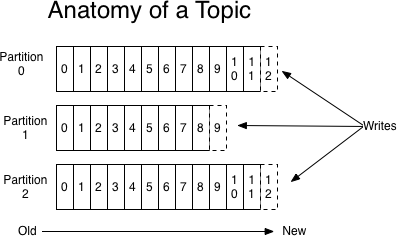
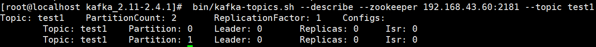
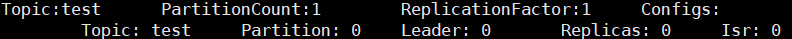
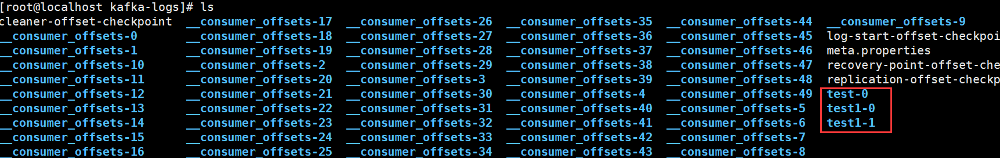
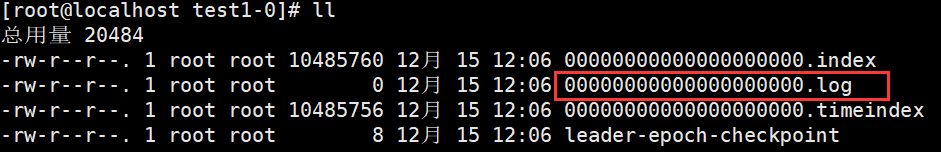
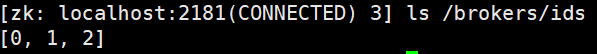
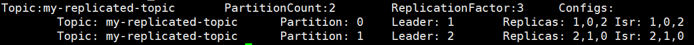
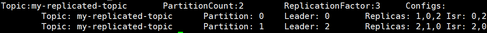
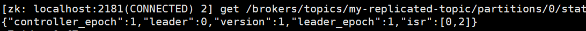
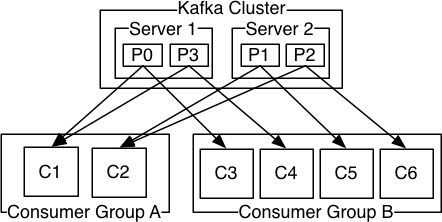

##### Kafka是最初由Linkedin公司开发，是一个分布式、支持分区的（partition）、多副本的（replica），基于zookeeper协 调的分布式消息系统，它的最大的特性就是可以实时的处理大量数据以满足各种需求场景：比如基于hadoop的批处理系 统、低延迟的实时系统、Storm/Spark流式处理引擎，web/nginx日志、访问日志，消息服务等等，用scala语言编写， Linkedin于2010年贡献给了Apache基金会并成为顶级开源 项目。

#### Kafka的使用场景

- 日志收集：一个公司可以用Kafka收集各种服务的log，通过kafka以统一接口服务的方式开放给各种consumer，例如hadoop、Hbase、Solr等。

- 消息系统：解耦和生产者和消费者、缓存消息等。

- 用户活动跟踪：Kafka经常被用来记录web用户或者app用户的各种活动，如浏览网页、搜索、点击等活动，这 些活动信息被各个服务器发布到kafka的topic中，然后订阅者通过订阅这些topic来做实时的监控分析，或者装载到hadoop、数据仓库中做离线分析和挖掘。

- 运营指标：Kafka也经常用来记录运营监控数据。包括收集各种分布式应用的数据，生产各种操作的集中反 馈，比如报警和报告。

**Kafka基本概念**

kafka是一个分布式的，分区的消息(官方称之为commit log)服务。它提供一个消息系统应该具备的功能，但是确有着独特的设计。可以这样来说，Kafka借鉴了JMS规范的思想，但是确并**没有完全遵循JMS规范。**

首先，让我们来看一下基础的消息(Message)相关术语：

| **名称**      | **解释**                                                                                                                                        |
|---------------|-------------------------------------------------------------------------------------------------------------------------------------------------|
| Broker        | 消息中间件处理节点，一个Kafka节点就是一个broker，一 个或者多个Broker可以组成一个Kafka集群                                                       |
| Topic         | Kafka根据topic对消息进行归类，发布到Kafka集群的每条 消息都需要指定一个topic                                                                     |
| Producer      | 消息生产者，向Broker发送消息的客户端                                                                                                            |
| Consumer      | 消息消费者，从Broker读取消息的客户端                                                                                                            |
| ConsumerGroup | 每个Consumer属于一个特定的Consumer Group，一条消息可以被多个不同的Consumer Group消费，但是一个 Consumer Group中只能有一个Consumer能够消费该消息 |
| Partition     | 物理上的概念，一个topic可以分为多个partition，每个 partition内部消息是有序的                                                                    |

##### 因此，从一个较高的层面上来看，producer通过网络发送消息到Kafka集群，然后consumer来进行消费，如下图：

服务端(brokers)和客户端(producer、consumer)之间通信通过**TCP协议**来完成。

**kafka基本使用**

#### 安装前的环境准备

由于Kafka是用Scala语言开发的，运行在JVM上，因此在安装Kafka之前需要先安装JDK。

kafka依赖zookeeper，所以需要先安装zookeeper

**第一步：下载安装包**

下载2.4.1 release版本，并解压：

#### 第二步：修改配置

修改配置文件config/server.properties:

**第三步：启动服务**

现在来启动kafka服务：

启动脚本语法：kafka­server­start.sh [­daemon] server.properties

可以看到，server.properties的配置路径是一个强制的参数，­daemon表示以后台进程运行，否则ssh客户端退出后， 就会停止服务。(注意，在启动kafka时会使用linux主机名关联的ip地址，所以需要把主机名和linux的ip映射配置到本地host里，用vim /etc/hosts)

| \# 启动kafka，运行日志在logs目录的server.log文件里 bin/kafka‐server‐start.sh ‐daemon config/server.properties \#后台启动，不会打印日志到控制台 或者用 bin/kafka‐server‐start.sh config/server.properties & 5 \# 我们进入zookeeper目录通过zookeeper客户端查看下zookeeper的目录树 bin/zkCli.sh ls / \#查看zk的根目录kafka相关节点 ls /brokers/ids \#查看kafka节点 10 11 \# 停 止 kafka |       |          |         |
|--------------------------------------------------------------------------------------------------------------------------------------------------------------------------------------------------------------------------------------------------------------------------------------------------------------------------------------------------------------------------------------|-------|----------|---------|
| 12 bin/                                                                                                                                                                                                                                                                                                                                                                              | kafka | ‐server‐ | stop.sh |

**server.properties核心配置详解：**

| **Property**       | **Default**                     | **Description**                                                                                                                                                                            |
|--------------------|---------------------------------|--------------------------------------------------------------------------------------------------------------------------------------------------------------------------------------------|
| broker.id          | 0                               | 每个broker都可以用一个唯一的非负整数id进行标识；这个id可以作为broker的“ 你可以选择任意你喜欢的数字作为id，只要id是唯一的即可。                                                             |
| log.dirs           | /tmp/kafka-logs                 | kafka存放数据的路径。这个路径并不是唯一的，可以是多个，路径之间只需要使用 隔即可；每当创建新partition时，都会选择在包含最少partitions的路径下进行。                                        |
| listeners          | PLAINTEXT://192.168.65.60:909 2 | server接受客户端连接的端口，ip配置kafka本机ip即可                                                                                                                                          |
|  zookeeper.connect |  localhost:2181                 | zooKeeper连接字符串的格式为：hostname:port，此处hostname和port分别是ZooKeeper集群中某个节点的host和port；zookeeper如果是集群，连接方式为 hostname1:port1, hostname2:port2, hostname3:port3 |

| log.retention.hours        | 168   | 每个日志文件删除之前保存的时间。默认数据保存时间对所有topic都一样。                                                                                |
|----------------------------|-------|----------------------------------------------------------------------------------------------------------------------------------------------------|
| num.partitions             | 1     | 创建topic的默认分区数                                                                                                                              |
| default.replication.factor | 1     | 自动创建topic的默认副本数量，建议设置为大于等于2                                                                                                   |
| min.insync.replicas        | 1     | 当producer设置acks为-1时，min.insync.replicas指定replicas的最小数目（必须 个repica的写数据都是成功的），如果这个数目没有达到，producer发送消息会产 |
| delete.topic.enable        | false | 是否允许删除主题                                                                                                                                   |
|                            |       |                                                                                                                                                    |

**第四步：创建主题**

现在我们来创建一个名字为“test”的Topic，这个topic只有一个partition，并且备份因子也设置为1：

现在我们可以通过以下命令来查看kafka中目前存在的topic

除了我们通过手工的方式创建Topic，当producer发布一个消息到某个指定的Topic，这个Topic如果不存在，就自动创 建。

**删除主题**

**第五步：发送消息**

kafka自带了一个producer命令客户端，可以从本地文件中读取内容，或者我们也可以以命令行中直接输入内容，并将这 些内容以消息的形式发送到kafka集群中。在默认情况下，每一个行会被当做成一个独立的消息。

首先我们要运行发布消息的脚本，然后在命令中输入要发送的消息的内容：

**第六步：消费消息**

对于consumer，kafka同样也携带了一个命令行客户端，会将获取到内容在命令中进行输出，**默认是消费最新的消息**：

如果想要消费之前的消息可以通过--from-beginning参数指定，如下命令：

如果你是通过不同的终端窗口来运行以上的命令，你将会看到在producer终端输入的内容，很快就会在consumer的终 端窗口上显示出来。

以上所有的命令都有一些附加的选项；当我们不携带任何参数运行命令的时候，将会显示出这个命令的详细用法。 **消费多主题**

**单播消费**

一条消息只能被某一个消费者消费的模式，类似queue模式，只需让所有消费者在同一个消费组里即可 分别在两个客户端执行如下消费命令，然后往主题里发送消息，结果只有一个客户端能收到消息

**多播消费**

一条消息能被多个消费者消费的模式，类似publish-subscribe模式费，针对Kafka同一条消息只能被同一个消费组下的某一个消 费者消费的特性，要实现多播只要保证这些消费者属于不同的消费组即可。我们再增加一个消费者，该消费者属于testGroup-2消费

组，结果两个客户端都能收到消息

**查看消费组名**

**查看消费组的消费偏移量**

**current-offset：**当前消费组的已消费偏移量

**log-end-offset：**主题对应分区消息的结束偏移量(HW) **lag：**当前消费组未消费的消息数

## 主题Topic和消息日志Log

可以理解**Topic是一个类别的名称**，同类消息发送到同一个Topic下面。对于每一个Topic，下面可以有多个分区(**Partition)**日志文件:

Partition是一个**有序的message序列**，这些message按顺序添加到一个叫做**commit log的文件**中。每个partition中的消息都有一个唯一的编号，称之为offset，用来唯一标示某个分区中的message。

**每个partition，都对应一个commit log文件**。一个partition中的message的offset都是唯一的，但是不同的partition 中的message的offset可能是相同的。

##### kafka一般不会删除消息，不管这些消息有没有被消费。只会根据配置的日志保留时间(log.retention.hours)确认消息多 久被删除，默认保留最近一周的日志消息。kafka的性能与保留的消息数据量大小没有关系，因此保存大量的数据消息日 志信息不会有什么影响。

**每个consumer是基于自己在commit log中的消费进度(offset)来进行工作的**。在kafka中，**消费offset由consumer自**

**己来维护**；一般情况下我们按照顺序逐条消费commit log中的消息，当然我可以通过指定offset来重复消费某些消息， 或者跳过某些消息。

这意味kafka中的consumer对集群的影响是非常小的，添加一个或者减少一个consumer，对于集群或者其他consumer 来说，都是没有影响的，因为每个consumer维护各自的消费offset。

**创建多个分区的主题：**

**查看下topic的情况**

以下是输出内容的解释，第一行是所有分区的概要信息，之后的每一行表示每一个partition的信息。

leader节点负责给定partition的所有读写请求。

replicas 表示某个partition在哪几个broker上存在备份。不管这个几点是不是”leader“，甚至这个节点挂了，也会列出。 isr 是replicas的一个子集，它只列出当前还存活着的，并且**已同步备份**了该partition的节点。

我们可以运行相同的命令查看之前创建的名称为”test“的topic

之前设置了topic的partition数量为1，备份因子为1，因此显示就如上所示了。

可以进入kafka的数据文件存储目录查看test和test1主题的消息日志文件：

消息日志文件主要存放在分区文件夹里的以log结尾的日志文件里，如下是test1主题对应的分区0的消息日志：

当然我们也可以通过如下命令**增加topic的分区数量(目前kafka不支持减少分区)**：

**可以这么来理解Topic，Partition和Broker**

##### 一个topic，代表逻辑上的一个业务数据集，比如按数据库里不同表的数据操作消息区分放入不同topic，订单相关操作消 息放入订单topic，用户相关操作消息放入用户topic，对于大型网站来说，后端数据都是海量的，订单消息很可能是非常 巨量的，比如有几百个G甚至达到TB级别，如果把这么多数据都放在一台机器上可定会有容量限制问题，那么就可以在 topic内部划分多个partition来分片存储数据，不同的partition可以位于不同的机器上，每台机器上都运行一个Kafka的 进程Broker。

**为什么要对Topic下数据进行分区存储？**

1、commit log文件会受到所在机器的文件系统大小的限制，分区之后可以将不同的分区放在不同的机器上，相当于对数据做了分布式存储，理论上一个topic可以处理任意数量的数据。

2、为了**提高并行度**。

# kafka集群实战

##### 对于kafka来说，一个单独的broker意味着kafka集群中只有一个节点。要想增加kafka集群中的节点数量，只需要多启动 几个broker实例即可。为了有更好的理解，现在我们在一台机器上同时启动三个broker实例。

首先，我们需要建立好其他2个broker的配置文件：

配置文件的需要修改的内容分别如下： config/server-1.properties:

| \#broker.id属性在kafka集群中必须要是唯一 broker.id=1 \#kafka部署的机器ip和提供服务的端口号 |                                 |
|--------------------------------------------------------------------------------------------|---------------------------------|
| 4 listeners                                                                                | =PLAINTEXT://192.168.65.60:9093 |

config/server-2.properties:

| broker.id listeners                                                           | =2 =PLAINTEXT://192.168.65.60:9094 |
|-------------------------------------------------------------------------------|------------------------------------|
| 3 log.dir=/usr/local/data/kafka‐logs‐2 4 zookeeper.connect=192.168.65.60:2181 |                                    |

目前我们已经有一个zookeeper实例和一个broker实例在运行了，现在我们只需要在启动2个broker实例即可：

**查看zookeeper确认集群节点是否都注册成功：**

##### 现在我们创建一个新的topic，副本数设置为3，分区数设置为2：

**查看下topic的情况**

以下是输出内容的解释，第一行是所有分区的概要信息，之后的每一行表示每一个partition的信息。

leader节点负责给定partition的所有读写请求，同一个主题不同分区leader副本一般不一样(为了容灾)

replicas 表示某个partition在哪几个broker上存在备份。不管这个几点是不是”leader“，甚至这个节点挂了，也会列出。 isr 是replicas的一个子集，它只列出当前还存活着的，并且**已同步备份**了该partition的节点。

现在我们向新建的 my-replicated-topic 中发送一些message，kafka集群可以加上所有kafka节点：

##### 现在开始消费：

现在我们来测试我们容错性，因为broker1目前是my-replicated-topic的分区0的leader，所以我们要将其kill

| 1 ps ‐       | ef \| | grep server.properties |
|--------------|-------|------------------------|
| 2 kill 14776 |       |                        |

##### 现在再执行命令：

我们可以看到，分区0的leader节点已经变成了broker 0。要注意的是，在Isr中，已经没有了1号节点。leader的选举也是从ISR(in-sync replica)中进行的。

此时，我们依然可以 消费新消息：

查看主题分区对应的leader信息：

**kafka将很多集群关键信息记录在zookeeper里，保证自己的无状态，从而在水平扩容时非常方便。**

**集群消费**

log的partitions分布在kafka集群中不同的broker上，每个broker可以请求备份其他broker上partition上的数据。kafka 集群支持配置一个partition备份的数量。

针对每个partition，都有一个broker起到“leader”的作用，0个或多个其他的broker作为“follwers”的作用。 **leader处理所有的针对这个partition的读写请求，而followers被动复制leader的结果，不提供读写(主要是为了保证多 副本数据与消费的一致性)**。如果这个leader失效了，其中的一个follower将会自动的变成新的leader。

**Producers**

##### 生产者将消息发送到topic中去，同时负责选择将message发送到topic的哪一个partition中。通过round­robin做简单的 负载均衡。也可以根据消息中的某一个关键字来进行区分。通常第二种方式使用的更多。

**Consumers**

传统的消息传递模式有2种：队列( queue) 和（publish-subscribe）

queue模式：多个consumer从服务器中读取数据，消息只会到达一个consumer。publish-subscribe模式：消息会被广播给所有的consumer。

Kafka基于这2种模式提供了一种consumer的抽象概念：consumer group。queue模式：所有的consumer都位于同一个consumer group 下。

publish-subscribe模式：所有的consumer都有着自己唯一的consumer group。

上图说明：由2个broker组成的kafka集群，某个主题总共有4个partition(P0-P3)，分别位于不同的broker上。这个集群 由2个Consumer Group消费， A有2个consumer instances ，B有4个。

通常一个topic会有几个consumer group，每个consumer group都是一个逻辑上的订阅者（ logical subscriber ）。每个consumer group由多个consumer instance组成，从而达到可扩展和容灾的功能。

**消费顺序**

一个partition同一个时刻在一个consumer group中只能有一个consumer instance在消费，从而保证消费顺序。**consumer group中的consumer instance的数量不能比一个Topic中的partition的数量多，否则，多出来的consumer消费不到消息。**

##### Kafka只在partition的范围内保证消息消费的局部顺序性，不能在同一个topic中的多个partition中保证总的消费顺序 性。

如果有在总体上保证消费顺序的需求，那么我们可以通过将topic的partition数量设置为1，将consumer group中的consumer instance数量也设置为1，但是这样会影响性能，所以kafka的顺序消费很少用。

**Java客户端访问Kafka**

引入maven依赖

消息发送端代码

1.  props.put(ProducerConfig.RETRY_BACKOFF_MS_CONFIG, 300);
2.  //设置发送消息的本地缓冲区，如果设置了该缓冲区，消息会先发送到本地缓冲区，可以提高消息发送性能，默认值是33554432，即32MB
3.  props.put(ProducerConfig.BUFFER_MEMORY_CONFIG, 33554432);

    36 \*//\*

4.  kafka本地线程会从缓冲区取数据，批量发送到broker，
5.  设置批量发送消息的大小，默认值是16384，即16kb，就是说一个batch满了16kb就发送出去

    39 \*//\*

    40 props.put(ProducerConfig.BATCH_SIZE_CONFIG, 16384);

    41 \*//\*

6.  默认值是0，意思就是消息必须立即被发送，但这样会影响性能
7.  一般设置10毫秒左右，就是说这个消息发送完后会进入本地的一个batch，如果10毫秒内，这个batch满了16kb就会随batch一起被发送出去
8.  如果10毫秒内，batch没满，那么也必须把消息发送出去，不能让消息的发送延迟时间太长

    45 \*//\*

9.  props.put(ProducerConfig.LINGER_MS_CONFIG, 10);\*/
10. //把发送的key从字符串序列化为字节数组
11. props.put(ProducerConfig.KEY_SERIALIZER_CLASS_CONFIG, StringSerializer.class.getName());
12. //把发送消息value从字符串序列化为字节数组
13. props.put(ProducerConfig.VALUE_SERIALIZER_CLASS_CONFIG, StringSerializer.class.getName());

    51

    52 Producer\<String, String\> producer = new KafkaProducer\<String, String\>(props);

    53

14. int msgNum = 5;
15. final CountDownLatch countDownLatch = new CountDownLatch(msgNum);
16. for (int i = 1; i \<= msgNum; i++) {
17. Order order = new Order(i, 100 + i, 1, 1000.00);
18. //指定发送分区
19. /\*ProducerRecord\<String, String\> producerRecord = new ProducerRecord\<String, String\>(TOPIC_NAME
20. , 0, order.getOrderId().toString(), JSON.toJSONString(order));\*/
21. //未指定发送分区，具体发送的分区计算公式：hash(key)%partitionNum
22. ProducerRecord\<String, String\> producerRecord = new ProducerRecord\<String, String\>(TOPIC_NAME
23. , order.getOrderId().toString(), JSON.toJSONString(order));

    64

24. //等待消息发送成功的同步阻塞方法
25. /\*RecordMetadata metadata = producer.send(producerRecord).get();
26. System.out.println("同步方式发送消息结果：" + "topic‐" + metadata.topic() + "\|partition‐"

    68 + metadata.partition() + "\|offset‐" + metadata.offset());\*/

    69

27. //异步回调方式发送消息
28. producer.send(producerRecord, new Callback() {
29. public void onCompletion(RecordMetadata metadata, Exception exception) {
30. if (exception != null) {
31. System.err.println("发送消息失败：" + exception.getStackTrace());

    75

    76 }

32. if (metadata != null) {
33. System.out.println("异步方式发送消息结果：" + "topic‐" + metadata.topic() + "\|partition‐"

    79 + metadata.partition() + "\|offset‐" + metadata.offset());

    80 }

    81 countDownLatch.countDown();

    82 }

    83 });

    84

    85 // 送 积 分 TODO

    86

    87 }

    88

34. countDownLatch.await(5, TimeUnit.SECONDS);
35. producer.close();

    91 }

    92 }

消息接收端代码

1 package com.tuling.kafka.kafkaDemo;

2

1.  import org.apache.kafka.clients.consumer.ConsumerConfig;
2.  import org.apache.kafka.clients.consumer.ConsumerRecord;
3.  import org.apache.kafka.clients.consumer.ConsumerRecords;
4.  import org.apache.kafka.clients.consumer.KafkaConsumer;
5.  import org.apache.kafka.common.serialization.StringDeserializer;

    8

6.  import java.time.Duration;
7.  import java.util.Arrays;
8.  import java.util.Properties;

    12

9.  public class MsgConsumer {
10. private final static String TOPIC_NAME = "my‐replicated‐topic";
11. private final static String CONSUMER_GROUP_NAME = "testGroup";

    16

12. public static void main(String[] args) {
13. Properties props = new Properties();

    19 props.put(ConsumerConfig.BOOTSTRAP_SERVERS_CONFIG, "192.168.65.60:9092,192.168.65.60:9093,192.168.65.60:9094");

14. // 消费分组名
15. props.put(ConsumerConfig.GROUP_ID_CONFIG, CONSUMER_GROUP_NAME);
16. // 是否自动提交offset，默认就是true
17. props.put(ConsumerConfig.ENABLE_AUTO_COMMIT_CONFIG, "true");
18. // 自动提交offset的间隔时间
19. props.put(ConsumerConfig.AUTO_COMMIT_INTERVAL_MS_CONFIG, "1000");
20. //props.put(ConsumerConfig.ENABLE_AUTO_COMMIT_CONFIG, "false");

    27 /\*

21. 当消费主题的是一个新的消费组，或者指定offset的消费方式，offset不存在，那么应该如何消费
22. latest(默认) ：只消费自己启动之后发送到主题的消息
23. earliest：第一次从头开始消费，以后按照消费offset记录继续消费，这个需要区别于consumer.seekToBeginning(每次都从头开始消费)

    31 \*/

    32 //props.put(ConsumerConfig.AUTO_OFFSET_RESET_CONFIG, "earliest");

    33 /\*

24. consumer给broker发送心跳的间隔时间，broker接收到心跳如果此时有rebalance发生会通过心跳响应将
25. rebalance方案下发给consumer，这个时间可以稍微短一点

    36 \*/

    37 props.put(ConsumerConfig.HEARTBEAT_INTERVAL_MS_CONFIG, 1000);

    38 /\*

26. 服务端broker多久感知不到一个consumer心跳就认为他故障了，会将其踢出消费组，
27. 对应的Partition也会被重新分配给其他consumer，默认是10秒

    41 \*/

28. props.put(ConsumerConfig.SESSION_TIMEOUT_MS_CONFIG, 10 \* 1000);
29. //一次poll最大拉取消息的条数，如果消费者处理速度很快，可以设置大点，如果处理速度一般，可以设置小点
30. props.put(ConsumerConfig.MAX_POLL_RECORDS_CONFIG, 500);

    45 /\*

31. 如果两次poll操作间隔超过了这个时间，broker就会认为这个consumer处理能力太弱，
32. 会将其踢出消费组，将分区分配给别的consumer消费

    48 \*/

33. props.put(ConsumerConfig.MAX_POLL_INTERVAL_MS_CONFIG, 30 \* 1000);
34. props.put(ConsumerConfig.KEY_DESERIALIZER_CLASS_CONFIG, StringDeserializer.class.getName());
35. props.put(ConsumerConfig.VALUE_DESERIALIZER_CLASS_CONFIG, StringDeserializer.class.getName());
36. KafkaConsumer\<String, String\> consumer = new KafkaConsumer\<String, String\>(props);

    53

37. consumer.subscribe(Arrays.asList(TOPIC_NAME));
38. // 消费指定分区
39. //consumer.assign(Arrays.asList(new TopicPartition(TOPIC_NAME, 0)));

    57

40. //消息回溯消费
41. /\*consumer.assign(Arrays.asList(new TopicPartition(TOPIC_NAME, 0)));
1.  consumer.seekToBeginning(Arrays.asList(new TopicPartition(TOPIC_NAME, 0)));\*/

    61

2.  //指定offset消费
3.  /\*consumer.assign(Arrays.asList(new TopicPartition(TOPIC_NAME, 0)));
4.  consumer.seek(new TopicPartition(TOPIC_NAME, 0), 10);\*/

    65

5.  //从指定时间点开始消费
6.  /\*List\<PartitionInfo\> topicPartitions = consumer.partitionsFor(TOPIC_NAME);
7.  //从1小时前开始消费
8.  long fetchDataTime = new Date().getTime() ‐ 1000 \* 60 \* 60;
9.  Map\<TopicPartition, Long\> map = new HashMap\<\>();
10. for (PartitionInfo par : topicPartitions) {
11. map.put(new TopicPartition(topicName, par.partition()), fetchDataTime);

    73 }

12. Map\<TopicPartition, OffsetAndTimestamp\> parMap = consumer.offsetsForTimes(map);
13. for (Map.Entry\<TopicPartition, OffsetAndTimestamp\> entry : parMap.entrySet()) {
14. TopicPartition key = entry.getKey();
15. OffsetAndTimestamp value = entry.getValue();
16. if (key == null \|\| value == null) continue;
17. Long offset = value.offset();
18. System.out.println("partition‐" + key.partition() + "\|offset‐" + offset);
19. System.out.println();
20. //根据消费里的timestamp确定offset
21. if (value != null) {
22. consumer.assign(Arrays.asList(key));
23. consumer.seek(key, offset);

    86 }

    87 }\*/

    88

    89 while (true) {

    90 /\*

    91 \* poll() API 是拉取消息的长轮询

    92 \*/

24. ConsumerRecords\<String, String\> records = consumer.poll(Duration.ofMillis(1000));
25. for (ConsumerRecord\<String, String\> record : records) {
26. System.out.printf("收到消息：partition = %d,offset = %d, key = %s, value = %s%n", record.partition(),
27. record.offset(), record.key(), record.value());

    97 }

    98

28. /\*if (records.count() \> 0) {
29. // 手动同步提交offset，当前线程会阻塞直到offset提交成功
30. // 一般使用同步提交，因为提交之后一般也没有什么逻辑代码了
31. consumer.commitSync();
32. 
33. // 手动异步提交offset，当前线程提交offset不会阻塞，可以继续处理后面的程序逻辑
34. consumer.commitAsync(new OffsetCommitCallback() {
35. @Override
36. public void onComplete(Map\<TopicPartition, OffsetAndMetadata\> offsets, Exception exception) {
37. if (exception != null) {
38. System.err.println("Commit failed for " + offsets);
39. System.err.println("Commit failed exception: " + exception.getStackTrace());

    111 }

    112 }

    113 });

    114

    115 }\*/

    116 }

    117 }

    118 }

### Spring Boot整合Kafka

引入spring boot kafka依赖，详见项目实例：spring-boot-kafka

application.yml配置如下：

发送者代码：

消费者代码：
